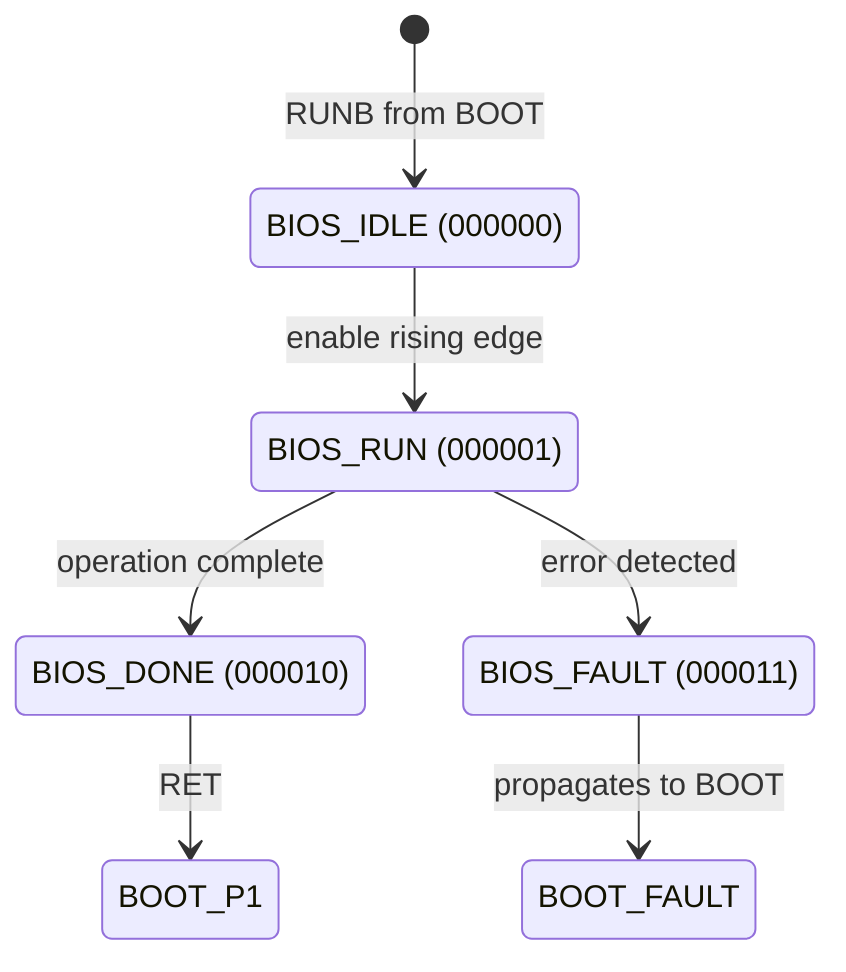

# BIOS-FSM Specification

This document specifies the BIOS module's Finite State Machine, which provides diagnostic and ROM waveform generation capabilities during the boot process.

> [!warning] Current Implementation
> The current RTL (`B1_BOOT_BIOS.vhd`) is a **validation stub** that auto-advances through states for hardware testing. The full BIOS implementation (ROM waveforms, calibration routines) is planned but not yet implemented.

## Overview

The BIOS module is dispatched from BOOT when the user issues `RUNB`. It provides diagnostic functions and ROM-based waveform generation. Control returns to BOOT via `RET`.



## State Definitions

| State | 6-bit Encoding | Global S | HVS Voltage | Description |
|-------|----------------|----------|-------------|-------------|
| BIOS_IDLE | `000000` | 8 | 0.240V | Entry state, waiting for operation |
| BIOS_RUN | `000001` | 9 | 0.270V | Executing diagnostic/waveform |
| BIOS_DONE | `000010` | 10 | 0.300V | Complete, ready for RET |
| BIOS_FAULT | `000011` | 11 | Negative | Error state (propagates to BOOT) |

> **Note:** BIOS uses the pre-PROG HVS encoding (197 units/state) with global S values 8-15.
> See [BOOT-HVS-state-reference.md](boot/BOOT-HVS-state-reference.md) for complete voltage table.

## Control Interface

When BIOS is active, it receives enable signal from BOOT:

```
bios_enable : in std_logic   -- High when BOOT state = BIOS_ACTIVE
bios_complete : out std_logic -- Asserted when BIOS reaches DONE state
```

BIOS does not directly read CR registers - all configuration comes through the BOOT dispatcher.

### BOOT_CR0 Bits (handled by BOOT parent)

> **Authoritative Reference:** [BOOT-CR0.md](boot/BOOT-CR0.md)

```
BOOT_CR0[31:29] = RUN gate (must remain set)
BOOT_CR0[27]    = B (must remain set - BIOS selected)
BOOT_CR0[24]    = RET (return to BOOT_P1 when asserted)
```

| Command | BOOT_CR0 Value | Action |
|---------|----------------|--------|
| `CMD_RUNB` | `0xE8000000` | Dispatch to BIOS |
| `CMD_RET`  | `0xE1000000` | Return from BIOS to BOOT_P1 |

## State Transitions

### BIOS_IDLE → BIOS_RUN
- **Trigger:** Rising edge of `bios_enable` (fresh dispatch from BOOT)
- **Actions:** Begin diagnostic/waveform operation
- **Validation stub:** Immediate transition (1 cycle)

### BIOS_RUN → BIOS_DONE
- **Trigger:** Operation complete (counter expired in stub mode)
- **Actions:** Assert `bios_complete` signal
- **Validation stub:** After `BIOS_STUB_DELAY_CYCLES` (default 125000 = 1ms @ 125MHz)

### BIOS_DONE → BOOT_P1
- **Trigger:** User issues RET (CR0[24] = 1), causing `bios_enable` to go low
- **Actions:** BIOS resets to IDLE, control returns to BOOT dispatcher

### BIOS_RUN/DONE → BIOS_FAULT
- **Trigger:** Internal error detected
- **Actions:** BOOT observes fault, transitions to BOOT_FAULT
- **Note:** Currently unused in validation stub

## Validation Stub Behavior

The current implementation (`B1_BOOT_BIOS.vhd`) is a minimal stub for hardware validation:

```
┌─────────────────────────────────────────────────────────────────┐
│ Validation Stub Operation                                       │
├─────────────────────────────────────────────────────────────────┤
│ 1. BOOT dispatches to BIOS (bios_enable goes HIGH)              │
│ 2. BIOS detects rising edge → IDLE → RUN                        │
│ 3. Delay counter counts down (BIOS_STUB_DELAY_CYCLES)           │
│ 4. Counter expires → RUN → DONE, bios_complete asserted         │
│ 5. User issues RET → bios_enable goes LOW → DONE → IDLE         │
│ 6. Control returns to BOOT_P1                                   │
│                                                                 │
│ Purpose: Verify HVS state transitions on oscilloscope           │
│ Timing: Configurable via generic (default 1ms for scope view)   │
└─────────────────────────────────────────────────────────────────┘
```

### Generic Configuration

```vhdl
generic (
    BIOS_STUB_DELAY_CYCLES : natural := 125000  -- 1ms @ 125MHz
);
```

| Environment | Recommended Value | Rationale |
|-------------|-------------------|-----------|
| CocoTB sim | 10 | Fast test execution |
| Hardware scope | 125000 | Observable 1ms transitions |

## HVS Integration

BIOS uses the pre-PROG HVS encoding with global S values 8-15:

```vhdl
bios_hvs_encoder : forge_hierarchical_encoder
    generic map (
        DIGITAL_UNITS_PER_STATE  => 197,   -- ~30mV steps
        DIGITAL_UNITS_PER_STATUS => 11.0   -- ~1.7mV per status LSB
    )
    port map (...);
```

| OutputC Voltage | Global S | BIOS State |
|-----------------|----------|------------|
| 0.240V | 8 | BIOS_IDLE |
| 0.270V | 9 | BIOS_RUN |
| 0.300V | 10 | BIOS_DONE |
| Negative | 11 | BIOS_FAULT |

> See [BOOT-HVS-state-reference.md](boot/BOOT-HVS-state-reference.md) for complete voltage table.

## Planned Features (Future)

The full BIOS implementation will provide:

1. **ROM Waveform Generation**
   - 8 pre-computed waveforms (SIN, COS, TRI, SAW, SQR variants)
   - 128-sample LUTs, 16-bit signed values
   - See [BOOT-ROM-primitives-spec.md](docs/boot/BOOT-ROM-WAVES-prop.md)

2. **Diagnostic Functions**
   - DAC/ADC loopback tests
   - HVS calibration verification
   - Clock domain measurements

3. **Calibration Routines**
   - Offset/gain compensation
   - Temperature compensation tables

## Design Rationale

### Why Separate BIOS from BOOT?

BIOS provides "firmware-level" diagnostics that shouldn't be embedded in the dispatcher. Separating them:
1. Keeps BOOT dispatcher simple (just routing)
2. Allows BIOS complexity to grow without affecting BOOT
3. Makes testing easier (can test BIOS in isolation)

### Why Auto-Advance in Stub?

For hardware validation, we need observable state transitions without implementing complex functionality. The stub:
1. Exercises the complete dispatch/return path
2. Produces known HVS voltage steps for oscilloscope verification
3. Requires no Python-side protocol implementation

### Why Rising Edge Detection?

BIOS needs to know when it's freshly dispatched vs. re-entered. Rising edge of `bios_enable`:
1. Distinguishes fresh dispatch from continued operation
2. Allows BIOS to reset internal state on each entry
3. Prevents spurious re-triggering

## See Also

- [BOOT-CR0.md](boot/BOOT-CR0.md) - **Authoritative** BOOT_CR0 register specification
- [BOOT-HVS-state-reference.md](boot/BOOT-HVS-state-reference.md) - **Authoritative** HVS state table with all voltages
- [BOOT-FSM-spec.md](BOOT-FSM-spec.md) - BOOT dispatcher specification
- [LOAD-FSM-spec.md](LOAD-FSM-spec.md) - LOADER buffer transfer protocol
- [BOOT-ROM-WAVES-prop.md](boot/BOOT-ROM-WAVES-prop.md) - ROM waveform definitions
- [HVS-encoding-scheme.md](HVS-encoding-scheme.md) - Pre-PROG encoding design rationale
