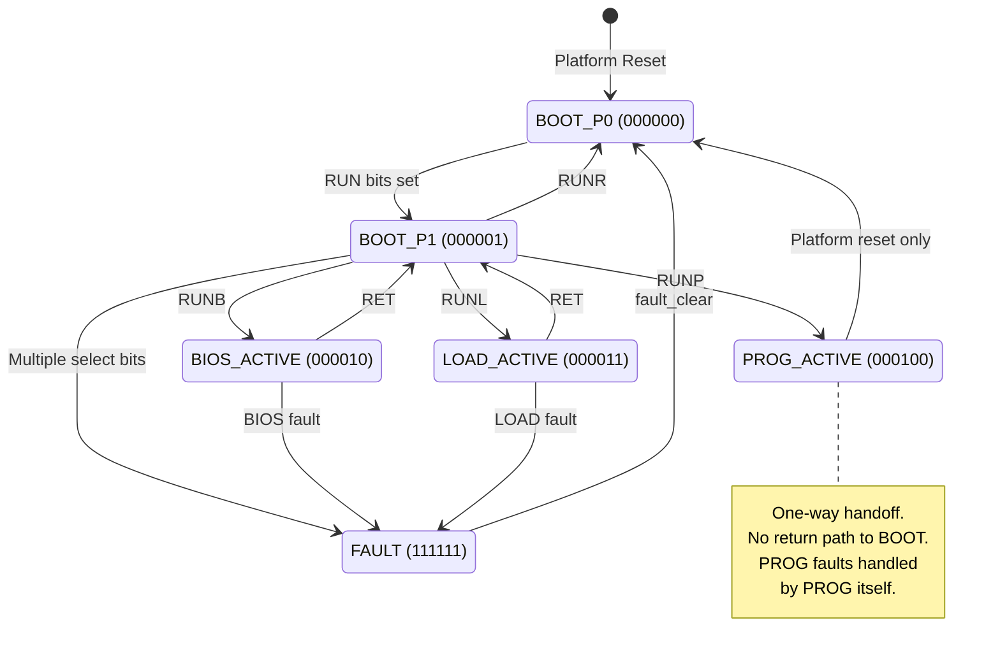

# BOOT-FSM Specification

This document specifies the BOOT module's Finite State Machine, which serves as the top-level dispatcher for the DPD platform boot process.

## Overview

The BOOT module implements a 6-state FSM that manages platform initialization and control transfer to one of three sub-modules: BIOS, LOADER, or PROG (the main application).



## State Definitions

| State       | 6-bit Encoding | Global S | HVS Voltage | Description                                                    |
| ----------- | -------------- | -------- | ----------- | -------------------------------------------------------------- |
| BOOT_P0     | `000000`       | 0        | 0.000V      | Initial/Reset phase. All CRs zeroed by platform.               |
| BOOT_P1     | `000001`       | 1        | 0.030V      | Settled/Dispatcher. Platform ready, awaiting module selection. |
| BIOS_ACTIVE | `000010`       | -        | (muxed)     | Control transferred to BIOS diagnostic module.                 |
| LOAD_ACTIVE | `000011`       | -        | (muxed)     | Control transferred to BUFFER LOADER module.                   |
| PROG_ACTIVE | `000100`       | -        | (muxed)     | Control transferred to main application (PROG).                |
| FAULT       | `111111`       | 2        | Negative    | Boot-level fault. Sign-flipped HVS indicates error.            |

> **Note:** When in BIOS/LOAD/PROG_ACTIVE states, OutputC is muxed from the active module's HVS encoder.
> See [BOOT-HVS-state-reference.md](boot/BOOT-HVS-state-reference.md) for complete voltage table.

## CR0 Bit Allocation

```
CR0[31]    = R (Ready)       ─┐
CR0[30]    = U (User)         ├─ RUN gate (must all be '1' for operation)
CR0[29]    = N (clkEnable)   ─┘
CR0[28]    = P (Program)     ─┐
CR0[27]    = B (BIOS)         ├─ Module select (mutually exclusive)
CR0[26]    = L (Loader)       │
CR0[25]    = R (Reset)       ─┘
CR0[24]    = RET             ─── Return to BOOT_P1 (from BIOS/LOAD only)
CR0[23:0]  = Reserved for future use
```

### Module Selection Commands

| Command | CR0 Value | Action |
|---------|-----------|--------|
| RUNP | `0xF0000000` | Transfer control to PROG (one-way) |
| RUNB | `0xE8000000` | Transfer control to BIOS |
| RUNL | `0xE4000000` | Transfer control to LOADER |
| RUNR | `0xE2000000` | Soft reset to BOOT_P0 |
| RET  | `0xE1000000` | Return from BIOS/LOAD to BOOT_P1 |

> **Note:** RUNP sets CR0[28]=1, which combined with RUN bits (CR0[31:29]=111) yields `0xF0000000`. The other commands keep CR0[28]=0.

## State Transitions

### BOOT_P0 → BOOT_P1
- **Trigger:** CR0[31:29] = `111` (RUN bits all set)
- **Actions:**
  - Zero all four ENV_BBUF regions (4x 4KB BRAM)
  - Enable BOOT-FSM dispatcher logic
- **User Experience:** User/driver sets RUN bits, proving platform has settled and a "head" is attached.

### BOOT_P1 → Module Selection
- **Trigger:** Exactly one of CR0[28:25] set
- **Priority:** P > B > L > R (if hardware priority encoder used)
- **Violation:** Multiple bits set → FAULT

### BIOS_ACTIVE / LOAD_ACTIVE → BOOT_P1
- **Trigger:** CR0[24] = `1` (RET bit)
- **Actions:** Return control to BOOT dispatcher
- **Use Case:** Expert workflow - load buffers, run diagnostics, then launch PROG

### BIOS_ACTIVE / LOAD_ACTIVE → FAULT
- **Trigger:** Sub-module asserts internal FAULT state
- **Actions:** BOOT immediately transitions to FAULT
- **HVS:** Negative voltage reveals fault origin via status bits

### PROG_ACTIVE
- **One-way handoff:** No return path to BOOT
- **PROG faults:** Handled by PROG itself, not propagated to BOOT
- **Exit:** Platform reset only (power cycle or external reset)

### FAULT → BOOT_P0
- **Trigger:** `fault_clear` signal (edge-triggered)
- **Actions:** Full reset to initial state

## Output Muxing

The BOOT module implements **combinatorial muxing** for OutputA/B/C to avoid introducing clock cycle delays:

```vhdl
-- Combinatorial assignment (no register delay)
OutputA <= bios_output_a when boot_state = BIOS_ACTIVE else
           load_output_a when boot_state = LOAD_ACTIVE else
           prog_output_a when boot_state = PROG_ACTIVE else
           boot_output_a;  -- BOOT_P0/P1

OutputB <= bios_output_b when boot_state = BIOS_ACTIVE else
           load_output_b when boot_state = LOAD_ACTIVE else
           prog_output_b when boot_state = PROG_ACTIVE else
           boot_output_b;

OutputC <= bios_output_c when boot_state = BIOS_ACTIVE else
           load_output_c when boot_state = LOAD_ACTIVE else
           prog_output_c when boot_state = PROG_ACTIVE else
           boot_output_c;  -- HVS-encoded BOOT state
```

This ensures the muxing is transparent to the PROG application with only ~1-2ns propagation delay through LUTs.

## HVS Integration

The BOOT subsystem uses the **pre-PROG HVS encoding scheme** with number-theory optimized parameters:

```vhdl
-- Pre-PROG encoding: 197 units/state, 11 units/status
boot_hvs_encoder : forge_hierarchical_encoder
    generic map (
        DIGITAL_UNITS_PER_STATE  => 197,   -- ~30mV steps
        DIGITAL_UNITS_PER_STATUS => 11.0   -- ~1.7mV per status LSB
    )
    port map (...);
```

- **DIGITAL_UNITS_PER_STATE = 197** (~30mV per state, keeps all pre-PROG < 1V)
- **Global S ranges:** BOOT=0-7, BIOS=8-15, LOADER=16-23, Reserved=24-31
- **OutputC** is muxed from the active module's HVS encoder
- **FAULT indication:** Negative voltage (sign flip when STATUS[7]=1)

### Oscilloscope Quick Reference

| Context | S Range | Voltage Band | Example States |
|---------|---------|--------------|----------------|
| BOOT    | 0-7     | 0.00-0.03V   | P0=0.000V, P1=0.030V |
| BIOS    | 8-15    | 0.24-0.33V   | IDLE=0.24V, RUN=0.27V, DONE=0.30V |
| LOADER  | 16-23   | 0.48-0.60V   | P0=0.48V, P1=0.51V, P2=0.54V, P3=0.57V |
| Reserved| 24-31   | 0.72-0.94V   | Future use |
| FAULT   | -       | Negative     | Sign flip indicates error |

> **For complete state table with all digital values:** See [BOOT-HVS-state-reference.md](boot/BOOT-HVS-state-reference.md)

> **Design rationale:** The ~30mV steps allow 32 states × 128 status levels while keeping all pre-PROG voltages under 1V. This leaves headroom for PROG applications to use higher voltages without overlap.

## ENV_BBUF (Environment BRAM Buffers)

The BOOT module allocates four 4KB BRAM regions for environment/configuration data:

| Buffer | Size | Purpose |
|--------|------|---------|
| ENV_BBUF_0 | 4KB | TBD - available to PROG |
| ENV_BBUF_1 | 4KB | TBD - available to PROG |
| ENV_BBUF_2 | 4KB | TBD - available to PROG |
| ENV_BBUF_3 | 4KB | TBD - available to PROG |

- **Zeroed** during BOOT_P0 → BOOT_P1 transition
- **Populated** by LOADER module (via LOAD_ACTIVE state)
- **Directly addressable** by PROG after handoff

## Expert Workflow Example

```
1. Platform powers on
   └─► BOOT_P0 (CRs zeroed)

2. User sets CR0 = 0xE0000000 (RUN)
   └─► BOOT_P1 (ENV_BBUFs zeroed, dispatcher ready)

3. User sets CR0 = 0xE4000000 (RUNL)
   └─► LOAD_ACTIVE
   └─► User populates ENV_BBUFs via LOADER

4. User sets CR0 = 0xE1000000 (RET)
   └─► BOOT_P1

5. User sets CR0 = 0xE8000000 (RUNB)
   └─► BIOS_ACTIVE
   └─► User runs diagnostics (may use populated buffers)

6. User sets CR0 = 0xE1000000 (RET)
   └─► BOOT_P1

7. User sets CR0 = 0xF0000000 (RUNP)
   └─► PROG_ACTIVE (one-way handoff)
   └─► Application runs with access to pre-loaded ENV_BBUFs
```

## Design Rationale

### Why Combinatorial Muxing?
All application outputs pass through the BOOT mux. Registered muxing would add a clock cycle delay visible to timing-sensitive applications. Combinatorial muxing adds only LUT propagation delay (~1-2ns), which is negligible at 125 MHz.

### Why No Return from PROG?
PROG is the "user application" - once launched, BOOT's job is done. This follows the principle that system-level boot code should not interfere with application execution. PROG handles its own faults.

### Why Propagate BIOS/LOAD Faults?
BIOS and LOADER are "system modules" under BOOT's supervision. If they fault, the boot process has failed and should be visible at the BOOT level for debugging.

### Why P > B > L > R Priority?
Usability: when a user manually sets bits from MSB to LSB in a GUI, they naturally land on RUNP first - the most common operation.

## See Also

- [BOOT-HVS-state-reference.md](boot/BOOT-HVS-state-reference.md) - **Authoritative** HVS state table with all voltages
- [HVS-encoding-scheme.md](HVS-encoding-scheme.md) - Pre-PROG encoding design rationale
- [LOAD-FSM-spec.md](LOAD-FSM-spec.md) - LOADER buffer transfer protocol
- [boot-process-terms.md](boot-process-terms.md) - Naming conventions
- [api-v4.md](api-v4.md) - Control register calling convention
- [hvs.md](hvs.md) - General HVS encoding documentation
