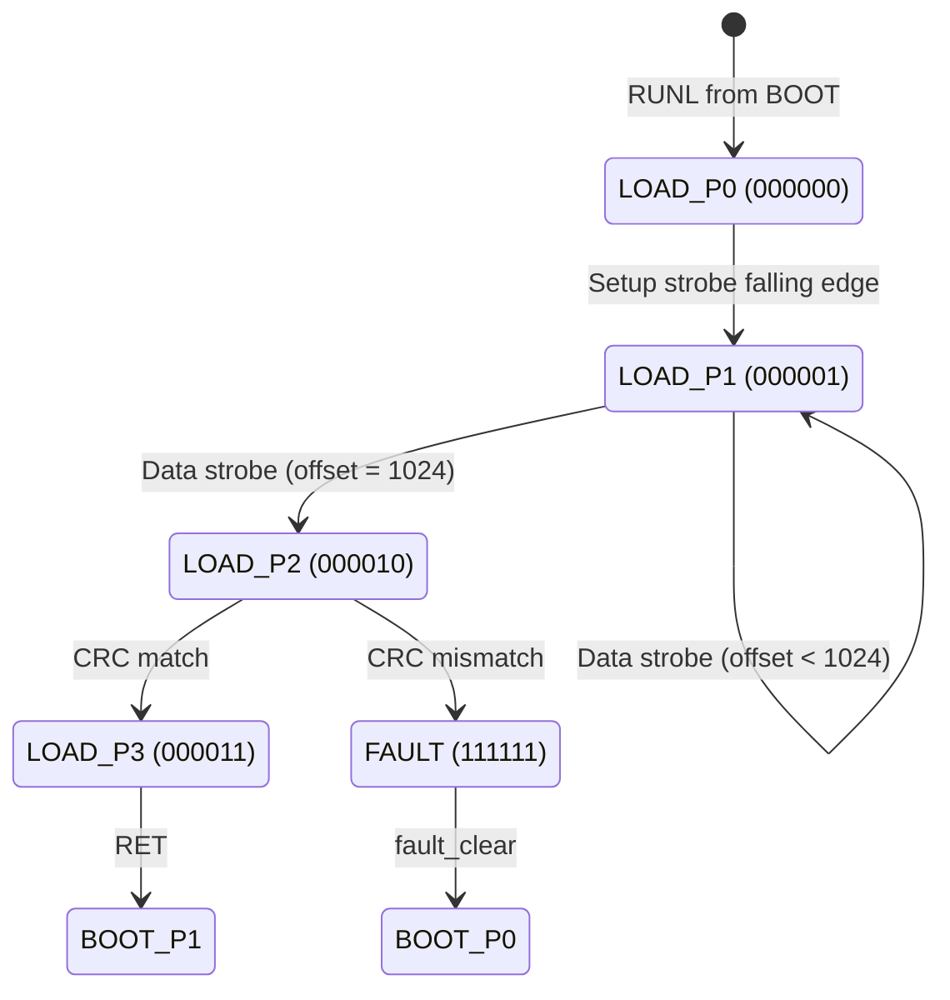

# LOAD-FSM Specification

This document specifies the LOADER module's Finite State Machine, which handles populating ENV_BBUFs with configuration data from the Python client.

## Overview

The LOADER module receives data from the Python client via Control Registers and writes it to 1-4 BRAM buffers (ENV_BBUFs). It uses a "blind handshake" protocol where both sides agree on fixed timing - no feedback path exists except HVS observation via oscilloscope.



## State Definitions

| State | 6-bit Encoding | Global S | HVS Voltage | Description |
|-------|----------------|----------|-------------|-------------|
| LOAD_P0 | `000000` | 16 | 0.481V | Setup phase - waiting for config |
| LOAD_P1 | `000001` | 17 | 0.511V | Transfer phase - receiving data |
| LOAD_P2 | `000010` | 18 | 0.541V | Validate phase - checking CRCs |
| LOAD_P3 | `000011` | 19 | 0.571V | Complete - ready for RET |
| FAULT | `111111` | 20 | Negative | CRC mismatch or protocol error |

> **Note:** LOADER uses the pre-PROG HVS encoding (197 units/state) with global S values 16-23.
> See [BOOT-HVS-state-reference.md](boot/BOOT-HVS-state-reference.md) for complete voltage table.

## BOOT_CR0 Allocation for LOADER

> **Authoritative Reference:** [BOOT-CR0.md](boot/BOOT-CR0.md)

When LOADER is active, it uses BOOT_CR0 control bits and CR1-CR4 for data:

```
BOOT_CR0[31:29] = RUN gate (must remain set)
BOOT_CR0[26]    = L (must remain set - LOADER selected)
BOOT_CR0[24]    = RET (return to BOOT_P1 when asserted)
BOOT_CR0[23:22] = BANK_SEL (ignored by LOADER - used for reads after loading)
BOOT_CR0[21]    = Data strobe (falling edge triggers parallel write)
BOOT_CR0[20:0]  = Reserved

CR1 = ENV_BBUF_0: CRC-16 during setup, data word during transfer
CR2 = ENV_BBUF_1: CRC-16 during setup, data word during transfer
CR3 = ENV_BBUF_2: CRC-16 during setup, data word during transfer
CR4 = ENV_BBUF_3: CRC-16 during setup, data word during transfer
```

### Always 4 Buffers

**Design Decision:** LOADER always writes **all 4 buffers** in parallel. There is no variable buffer count.

| CR | Target Buffer | Notes |
|----|---------------|-------|
| CR1 | ENV_BBUF_0 | Always written |
| CR2 | ENV_BBUF_1 | Always written |
| CR3 | ENV_BBUF_2 | Always written |
| CR4 | ENV_BBUF_3 | Always written |

If fewer than 4 buffers contain meaningful data, zero-fill the unused CRs.

## Protocol: Blind Handshake

Since the Python client cannot receive feedback from the bitstream (except via oscilloscope streaming), both sides agree on a **fixed phase count** and **generous timing** per phase.

### Timing Constants

| Parameter | Value | Rationale |
|-----------|-------|-----------|
| T_SETUP | 10ms | Time after setup strobe before first data |
| T_WORD | 1ms | Time between data strobes |
| T_VALIDATE | 10ms | Time for CRC validation after final data |

> **Note:** These timings are intentionally slow. Loading 4KB per buffer takes ~1 second. This happens once at startup and reliability is more important than speed.

### Protocol Sequence

```
┌─────────────────────────────────────────────────────────────────┐
│ Phase 0: Setup                                                  │
├─────────────────────────────────────────────────────────────────┤
│ 1. Client sets CR1-CR4 = expected CRC-16 values (all 4 buffers) │
│ 2. Client sets BOOT_CR0[21] = 1 (strobe HIGH)                   │
│ 3. Client waits T_STROBE (1ms)                                  │
│ 4. Client sets BOOT_CR0[21] = 0 (strobe LOW) ← LOADER latches   │
│ 5. Client waits T_SETUP (10ms)                                  │
│                                                                 │
│ LOADER: Latches CRC values for all 4 buffers on falling edge    │
│ LOADER: Initializes offset = 0, running CRCs = 0xFFFF (×4)      │
│ LOADER: Transitions to LOAD_P1                                  │
└─────────────────────────────────────────────────────────────────┘

┌─────────────────────────────────────────────────────────────────┐
│ Phase 1..1024: Data Transfer                                    │
├─────────────────────────────────────────────────────────────────┤
│ For each word (offset 0 to 1023):                               │
│   1. Client sets CR1-CR4 = data words for all buffers           │
│   2. Client sets BOOT_CR0[21] = 1 (strobe HIGH)                 │
│   3. Client waits T_STROBE (1ms)                                │
│   4. Client sets BOOT_CR0[21] = 0 (strobe LOW) ← LOADER writes  │
│   5. Client waits T_WORD (1ms)                                  │
│                                                                 │
│ LOADER: On falling edge:                                        │
│   - Writes CR1 → ENV_BBUF_0[offset] (if enabled)                │
│   - Writes CR2 → ENV_BBUF_1[offset] (if enabled)                │
│   - Writes CR3 → ENV_BBUF_2[offset] (if enabled)                │
│   - Writes CR4 → ENV_BBUF_3[offset] (if enabled)                │
│   - Updates running CRC for each buffer                         │
│   - Increments offset                                           │
│                                                                 │
│ After offset reaches 1024:                                      │
│ LOADER: Transitions to LOAD_P2                                  │
└─────────────────────────────────────────────────────────────────┘

┌─────────────────────────────────────────────────────────────────┐
│ Phase 1025: Validation                                          │
├─────────────────────────────────────────────────────────────────┤
│ Client waits T_VALIDATE (10ms)                                  │
│                                                                 │
│ LOADER: Compares running CRCs vs expected CRCs                  │
│   - All match → Transitions to LOAD_P3 (Complete)               │
│   - Any mismatch → Transitions to FAULT                         │
│                                                                 │
│ Client: Polls OutputC via oscilloscope                          │
│   - ~0.57V = LOAD_P3 = Success (S=19)                           │
│   - Negative voltage = FAULT = CRC mismatch                     │
└─────────────────────────────────────────────────────────────────┘

┌─────────────────────────────────────────────────────────────────┐
│ Phase 1026: Return                                              │
├─────────────────────────────────────────────────────────────────┤
│ Client sets BOOT_CR0[24] = 1 (CMD_RET)                          │
│                                                                 │
│ LOADER: Returns control to BOOT_P1                              │
│ BOOT: OutputC shows BOOT_P1 voltage (~0.03V, S=1)               │
└─────────────────────────────────────────────────────────────────┘
```

## CRC-16-CCITT Implementation

The LOADER uses CRC-16-CCITT for simple error detection:

- **Polynomial:** 0x1021 (x^16 + x^12 + x^5 + 1)
- **Initial value:** 0xFFFF
- **Input:** 32-bit words, processed MSB first

### VHDL Implementation (LFSR)

```vhdl
-- CRC-16-CCITT update for 32-bit word
-- Processes one byte at a time (4 iterations per word)
function crc16_update(crc : unsigned(15 downto 0);
                      data : std_logic_vector(31 downto 0))
    return unsigned is
    variable c : unsigned(15 downto 0) := crc;
    variable d : std_logic_vector(7 downto 0);
begin
    for i in 3 downto 0 loop  -- Process 4 bytes, MSB first
        d := data(i*8+7 downto i*8);
        for j in 7 downto 0 loop
            if (c(15) xor d(j)) = '1' then
                c := (c(14 downto 0) & '0') xor x"1021";
            else
                c := c(14 downto 0) & '0';
            end if;
        end loop;
    end loop;
    return c;
end function;
```

### Python Client CRC Calculation

```python
import crcmod

# CRC-16-CCITT
crc16_func = crcmod.predefined.mkCrcFun('crc-ccitt-false')

def compute_buffer_crc(data: bytes) -> int:
    """Compute CRC-16 for a 4KB buffer."""
    assert len(data) == 4096
    return crc16_func(data)
```

## Design Rationale

### Why Blind Handshake?

The Moku platform provides no read-back path for Control Registers or internal state. The only feedback mechanism is streaming OutputC via oscilloscope. Rather than implement complex retry logic based on oscilloscope readings, we use generous fixed timing that ensures success under all reasonable conditions.

### Why Falling Edge?

Rising edge detection can suffer from glitches if the client's write isn't atomic. Falling edge is more robust:
1. Client sets strobe HIGH
2. Client waits (strobe is stable HIGH)
3. Client sets strobe LOW
4. LOADER acts on the clean falling edge

### Why Parallel Writes?

Writing all 4 buffers in parallel with a shared offset pointer:
1. Simplifies address generation (single counter)
2. Reduces protocol complexity (one strobe per offset, not per buffer)
3. Makes timing predictable (always 1024 strobes)

### Why Always 4 Buffers?

The design mandates exactly 4 buffers with no variable count:
1. **Simpler protocol**: No BUFCNT field to negotiate
2. **Simpler hardware**: No conditional logic in LOADER
3. **Zero cost**: Unused buffers receive zeros (no extra hardware)
4. **Consistent CRC**: Always validate all 4 CRCs

### Why CRC-16 Not CRC-32?

CRC-16-CCITT is:
1. Simple LFSR implementation (~20 lines VHDL)
2. Sufficient for detecting bit flips over 4KB
3. Fits in 16 bits (easy to pack into CR registers)
4. Well-supported in Python (`crcmod`)

We're not protecting against adversarial corruption - just network/timing glitches.

### Why 1ms Per Word?

At 1ms per word:
- 1024 words × 1ms = ~1 second per buffer load
- Network RTT is typically 10-50ms for Moku
- 1ms provides 10-100x margin over network latency

This is deliberately conservative. Speed is not a concern for one-time startup loading.

## HVS Integration

LOADER uses the pre-PROG HVS encoding with global S values 16-23:

```vhdl
loader_hvs_encoder : forge_hierarchical_encoder
    generic map (
        DIGITAL_UNITS_PER_STATE  => 197,   -- ~30mV steps
        DIGITAL_UNITS_PER_STATUS => 11.0   -- ~1.7mV per status LSB
    )
    port map (...);
```

| OutputC Voltage | Global S | LOADER State |
|-----------------|----------|--------------|
| 0.481V | 16 | LOAD_P0 (setup) |
| 0.511V | 17 | LOAD_P1 (transfer) |
| 0.541V | 18 | LOAD_P2 (validate) |
| 0.571V | 19 | LOAD_P3 (complete) |
| Negative | 20 | FAULT |

> See [BOOT-HVS-state-reference.md](boot/BOOT-HVS-state-reference.md) for complete voltage table.

## Python Client Example

```python
import time
from moku.instruments import CloudCompile
from py_tools.boot_constants import CMD, BOOT_CR0_LOADER_STROBE_BIT

class BootLoader:
    T_STROBE = 0.001   # 1ms strobe width
    T_SETUP = 0.010    # 10ms setup delay
    T_WORD = 0.001     # 1ms between words
    T_VALIDATE = 0.010 # 10ms validation delay

    def __init__(self, moku: CloudCompile):
        self.moku = moku

    def load_buffers(self, buffers: list[bytes]) -> bool:
        """Load up to 4 buffers (each 4KB) into ENV_BBUFs.

        Always writes all 4 buffers. If fewer than 4 are provided,
        remaining buffers are zero-filled.
        """
        assert 1 <= len(buffers) <= 4
        assert all(len(b) == 4096 for b in buffers)

        # Pad to 4 buffers with zeros
        while len(buffers) < 4:
            buffers.append(bytes(4096))

        # Compute CRCs for all 4 buffers
        crcs = [compute_buffer_crc(b) for b in buffers]

        # Phase 0: Setup - send expected CRCs
        self.moku.set_control(0, CMD.RUNL)  # No buffer count needed
        self.moku.set_control(1, crcs[0])
        self.moku.set_control(2, crcs[1])
        self.moku.set_control(3, crcs[2])
        self.moku.set_control(4, crcs[3])

        # Strobe setup
        self._strobe()
        time.sleep(self.T_SETUP)

        # Phase 1..1024: Data transfer (always all 4 buffers)
        for offset in range(1024):
            for i in range(4):
                word = int.from_bytes(buffers[i][offset*4:(offset+1)*4], 'big')
                self.moku.set_control(i + 1, word)
            self._strobe()
            time.sleep(self.T_WORD)

        # Phase 1025: Wait for validation
        time.sleep(self.T_VALIDATE)

        # Check result via oscilloscope (implementation varies)
        return self._check_success()

    def _strobe(self):
        """Pulse BOOT_CR0[21] high then low."""
        boot_cr0 = self.moku.get_control(0)
        self.moku.set_control(0, boot_cr0 | (1 << BOOT_CR0_LOADER_STROBE_BIT))
        time.sleep(self.T_STROBE)
        self.moku.set_control(0, boot_cr0 & ~(1 << BOOT_CR0_LOADER_STROBE_BIT))

    def _check_success(self) -> bool:
        """Check OutputC via oscilloscope for success/fault."""
        # Implementation depends on oscilloscope streaming setup
        # Returns True if OutputC shows LOAD_P3 voltage (0.6V)
        # Returns False if OutputC shows negative voltage (FAULT)
        pass
```

## See Also

- [BOOT-CR0.md](boot/BOOT-CR0.md) - **Authoritative** BOOT_CR0 register specification
- [BOOT-HVS-state-reference.md](boot/BOOT-HVS-state-reference.md) - **Authoritative** HVS state table with all voltages
- [BOOT-FSM-spec.md](BOOT-FSM-spec.md) - BOOT module specification
- [BIOS-FSM-spec.md](BIOS-FSM-spec.md) - BIOS diagnostics state machine
- [HVS-encoding-scheme.md](HVS-encoding-scheme.md) - Pre-PROG encoding design rationale
- [boot-process-terms.md](boot-process-terms.md) - Naming conventions
