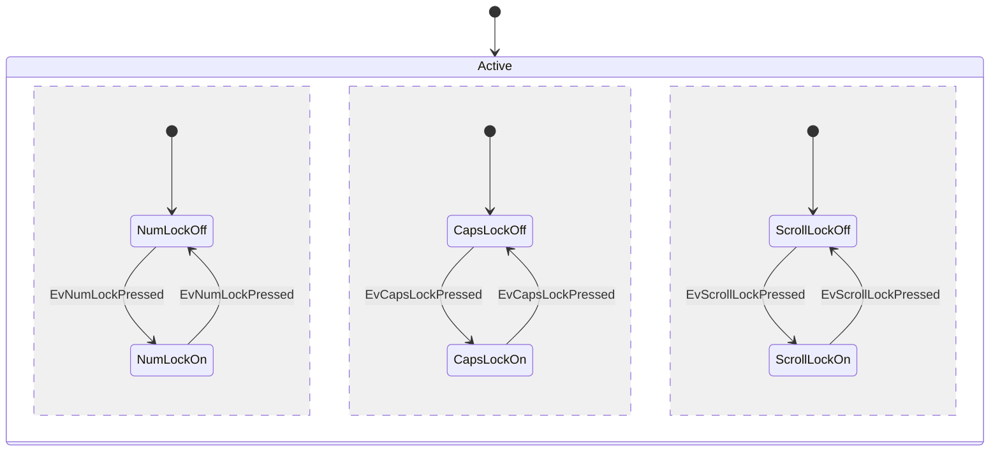

# BOOT-PROCESS
This following work should be performed on the `feature/BOOT0_Process`

# @CLAUDE 
Review the hand-drawn notes above and then
1) review the overall concept / details with the user
2) Modify the state diagram provided below to match the user expectations.

        
----
1. **S0 vs S1 Relationship**:
We aer still working on an authoritative naming / numbering scheme for how we describe the state of the 'boot process'. Here are my current thoughts

## STATE NAMING SCHEMES
In order to allow us to speak about these different modules with a consistent name/numbering scheme, I propose the following convention:

- `BOOT-P0`
- `BIOS-P0`
- `BUFF-P0`
- `PROG-S0`
> [!NOTE] the switch to 'Stages' for 'Program' in lieu of 'PHASES' terminology is intentional. It aligns cleanly with the 'STATE' terminiology for 'the' FSM 
> Although it is inevitable that most documentation will be __within__ the 'PROGRAM' context, this should help identify isntances when users/user-level code is trying to refer to their own internal states, while avoiding confusion between the built in `BOOT` `BIOS` and `BUFF` modules

### `BOOT-P0` : BOOT-PHASE0 
**`BOOT0-P0`** essentially represents 'instruction zero' in the boot handoff process. In this phase:
- All CR's are zero'd (by the moku platform)
- Reset and Clock will be applied by the moku platform. (See [[mim](moku_md/instruments/mim.md)] and [cloudcompile](moku_md/instruments/cloudcompile.md))

### `BOOT-P1` : 'Settled' / 'RUN'
- The platform has settled and the magical 'RUN' bits in CR0[31-29] are set.  At this point the BOOT-FSM should be engaged which will allow the python client (aka 'user') to select one of three (technically 4) possible state transitions:

> [!NOTE] From the user experience, the transition from `BOOT-P0` -> `BOOT-P1` will be the result of a user-agent typing 'RUN', thus setting CR0[31-29] and proving that the platform has indeed settle and there is a 'head' attached to this system so it can start to safely be driven. 

The follow states should be reachable from `BOOT-P1` 'RUN>' in response to the user/driver entering / selecting one of the following (which will then set the appropriately defined bit in `CR0`)
#### `BIOS-P0` (`RUNB`) -> `Run BIOS`
Control will be transferred to the BIOS module. The details of this module are out of scope for the moment, but it will be a small self-contained module that can be used to diagnose wiring/connection issues on the moku platform by reliably and safely generating known reference signals on all available outputs.

#### `LOAD-P0` (`RUNL`) -> `Run Loader`
Control will be transferred to the Buffer **L**oader  module.  -- details TBD.

#### `RESET-P0` (`RUNR`) -> `Run Reset` 
- Serves as a 'soft reset' by: 
- intentionally returning to `BOOT0-P0` with all CR's zeroized

And lastly, 
#### `PROG-P0` (`RUNP`) -> `Run Program`
Transfer control to the main application program (BPD in this case)

> Contents

	#### `RUN-B` (BIOS) 
	

The general approach in this project is to put as much 'smarts' inside the python clients that will be driving these bitstreams by settign the Control Register bits remotely over the network. 

By convention we treat Control0 (aka `CR0`) as a 'priviliged'  / special case register that 'application' or 'program logic' should be unable to access in normal circumstances. 

## `LOAD0-P0`: `LOADER-0, PHASE-0`
**`L0-P0`** represents the handoff to the **buffer loader module**. This module will
- populate 0-4 fixed length BRAM buffers ( we are tentatively calling these `ENV_BBUFS` - but we arent married to the terminology)

### `P0-S0` : `PROGRAM 0, State-0`
This represents the initial handoff to the 'application' or 'program' logic

1. Is S0 the "moku loader handoff" phase and S1 the "application ready" phase? Or do these map to specific FSM states?

2. **ENV_BBUF (Environment BRAM Buffer)**:
    
    - Is the "4K" referring to 4KB memory blocks?
    - What does "zero'ed" mean here - clearing them before use, or validating they're empty?
3. **The Three Boot Paths (P', B', L')**:
    
    - **P' (Program)**: This launches the main DPD application?
    - **B' (BIOS)**: A diagnostic/troubleshooting mode (matches B010_BIOS.md)?
    - **L' (BBUF_LOADER)**: A dedicated BRAM loading mode?
    - How does the system decide which path to take - is it CR0 bit selection?
4. **"Latch One" Semantics**: Does this mean only one of P'/B'/L' can be active at a time (mutual exclusion)?
    
5. **BPD-Handoff**: Is "BPD" a typo for "DPD" (Demo Probe Driver), or is this a new "Boot Probe Driver" concept?
    
6. **The S0 State Diagram**: The bubbles show S0 connecting to BIOS and BUFF_LOAD - is this saying S0 is a dispatcher that can branch to either subsystem before reaching "RUN"?
    
7. **CR0 Bit Allocation**: Looking at your docs:
    
    - CR0[31:29] = RUN (Ready, User, clkEN)
    - CR0[28] = P (Program)
    - CR0[27] = B (BIOS)
    - Is CR0[26] intended for L (BBUF_LOADER)?
8. **The placeholder state diagram** in the session file shows a keyboard lock metaphor - should I interpret this as concurrent/parallel state machines (like NumLock/CapsLock can be independently on/off), or was that just a template placeholder?